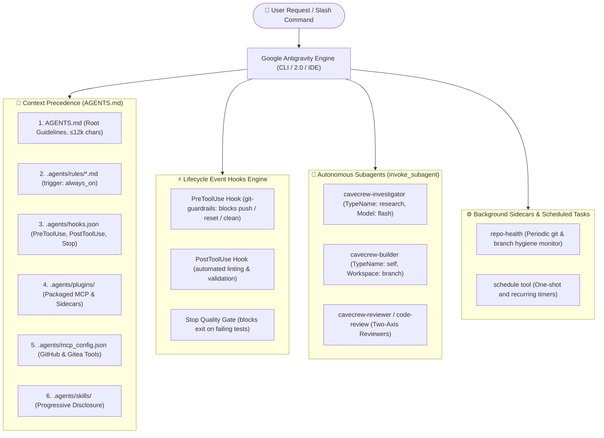

<div align="center">


# AAC (Antigravity Agent Core)

**Minimalist autonomous engineering framework for Google Antigravity.**  
*Engineered for Gemini 3.8 Flash (High) • Native Progressive Disclosure • Lifecycle Hooks • Multi-Agent Workspaces*

<p align="center">
  <a href="https://github.com/rafaelghif/antigravity-agents-core/releases/tag/v5.2.0"></a>
  <a href="https://antigravity.google/docs"></a>
  <a href="https://antigravity.google/docs/rules-workflows"></a>
  <a href="#-autonomous-skills-suite"></a>
  <a href="LICENSE"></a>
</p>

<p align="center">
  <a href="#-quick-start-multi-platform">Quick Start</a> •
  <a href="#-architecture-overview">Architecture</a> •
  <a href="#-always-on-operational-rules">Always-On Rules</a> •
  <a href="#-repository-layout">Repository Layout</a> •
  <a href="#-autonomous-skills-suite">Skill Catalog</a> •
  <a href="#-5-tier-memory-management">Memory System</a> •
  <a href="#-lifecycle-hooks--security">Lifecycle Hooks</a> •
  <a href="#-model-context-protocol-mcp">MCP Setup</a>
</p>

</div>

---

## ⚡ Overview

**AAC (Antigravity Agent Core)** is a minimalist autonomous engineering framework built for the **Google Antigravity Customization Architecture**. It provides focused pair programming, autonomous multi-agent task execution, and progressive context disclosure without token waste or hallucinated tooling.

<table>
  <tr>
    <td width="33%" align="center">
      <h3>🚀 Native Tool Calling</h3>
      <p>Seamless execution with Google Antigravity primitives: <code>run_command</code>, <code>replace_file_content</code>, <code>view_file</code>, and <code>invoke_subagent</code>.</p>
    </td>
    <td width="33%" align="center">
      <h3>🧠 Minimalist & Terse</h3>
      <p>Tailored for Gemini 3.8 Flash (High) via <b>Caveman Protocol</b> (fluff-free precision) and the 7-rung <b>Ponytail Ladder</b> (YAGNI to one-liners).</p>
    </td>
    <td width="33%" align="center">
      <h3>🔒 Zero Global Pollution</h3>
      <p>Strictly workspace-scoped within <code>.agents/</code>. Zero machine-global pollution (<code>~/.gemini/config/</code>) and zero <code>package.json</code> pollution.</p>
    </td>
  </tr>
  <tr>
    <td width="33%" align="center">
      <h3>🛡️ Production Realism</h3>
      <p>Strict anti-dummy/mock standard via <b>Production Integrity</b>. Zero unverified assumptions, real schemas, and genuine error boundaries.</p>
    </td>
    <td width="33%" align="center">
      <h3>⚡ Lifecycle Hooks</h3>
      <p>PreToolUse interception blocking dangerous git commands and quality-gate Stop hooks enforcing test passage before session termination.</p>
    </td>
    <td width="33%" align="center">
      <h3>🧩 5-Tier Memory Hierarchy</h3>
      <p>Clean context partitioning: intra-session, workspace directives, living domain models, cross-session handoff, and task graphs.</p>
    </td>
  </tr>
</table>

---

## ⚡ Quick Start (Multi-Platform)

Install AAC into **any existing project** (Python, Go, Rust, Node, Java, PHP, C++) with a single command:

### Option 1: Universal NPX (Any OS with Node.js)
```bash
# Via npm registry:
npx @rafaelghif/aac-core init

# Or directly from GitHub:
npx github:rafaelghif/antigravity-agents-core init
```

### Option 2: Standalone Windows PowerShell (Zero Node.js Prerequisite)
```powershell
irm https://raw.githubusercontent.com/rafaelghif/antigravity-agents-core/main/install.ps1 | iex
```

### Option 3: Standalone Linux / macOS (Zero Node.js Prerequisite)
```bash
curl -fsSL https://raw.githubusercontent.com/rafaelghif/antigravity-agents-core/main/install.sh | bash
```

### Upgrading an Existing Workspace
If you are already running an earlier version of AAC (e.g. `v5.0.3` or `v5.1.0`), safely update core rules, skills, plugins, and lifecycle hooks with zero risk to your custom domain work:

```bash
# Universal NPX (recommended):
npx @rafaelghif/aac-core upgrade

# Windows PowerShell:
powershell -ExecutionPolicy Bypass -File install.ps1 -Upgrade

# Linux / macOS:
bash install.sh --upgrade
```

> [!TIP]
> **Strict Upgrade Protections**:
> - 🔒 **Domain Glossary & Architecture**: Existing [`CONTEXT.md`](CONTEXT.md) is strictly preserved and never overwritten.
> - 🔒 **Workspace Secrets**: Existing [`.agents/mcp_config.json`](.agents/mcp_config.json) API tokens and MCP settings remain untouched.
> - 🔄 **Smart Hooks Merging**: Updates framework lifecycle hooks while preserving all user-added custom hooks and toggle states (`enabled: false/true`).
> - 📁 **Scratchpad Continuity**: Existing [`.scratch/`](.scratch) session handoffs are fully preserved.
> - 🛡️ **Zero Pollution**: Guaranteed never to create or mutate `package.json` in your project.

> [!IMPORTANT]
> **Zero Package.json Pollution Guarantee**: The installer will **NEVER** create, overwrite, or mutate `package.json` in your target repository. It cleanly scaffolds `.agents/`, `AGENTS.md`, and `CONTEXT.md`, and appends ignore rules to your `.gitignore`.

---

## 🏗️ Architecture Overview

The framework coordinates context precedence, lifecycle hooks, autonomous subagent graphs, and memory tiers:



---

## 📜 Always-On Operational Rules

AAC enforces deterministic engineering quality, communication brevity, and security through modular rules loaded into Antigravity context on every turn (`trigger: always_on`):

| Rule | Protocol / Philosophy | Core Directives | Primary File |
| :--- | :--- | :--- | :--- |
| `production-integrity` | **Zero Assumptions & Anti-Mock Standard** | Strict ban on dummy/fake/mock data in production code (`src/`, `lib/`, `app/`). Zero speculation; mandatory clarification via `/grill-me` or `ask_question`; test fixture isolation. | [production-integrity.md](.agents/rules/production-integrity.md) |
| `ponytail` | **7-Rung Minimalist Code Ladder** | Laziest senior dev mode: YAGNI &rarr; Existing Helpers &rarr; Standard Library &rarr; Platform Native &rarr; Installed Dep &rarr; One-Liner &rarr; Minimal Diff. Fix root causes, not symptoms. | [ponytail.md](.agents/rules/ponytail.md) |
| `caveman` | **Ultra-Compressed Communication** | Eliminates conversational fluff, polite filler, and tool narration. Delivers 100% technical substance, exact code, commands, and file links. | [caveman.md](.agents/rules/caveman.md) |
| `coding-standards` | **Production Code Quality & SRP** | Single Responsibility Principle, fail-fast boundary validation, explicit error handling, and targeted single-block file modifications. | [coding-standards.md](.agents/rules/coding-standards.md) |
| `git-workflow` | **Conventional Commits & Atomic History** | Enforces conventional commit prefixes (`feat:`, `fix:`, `chore:`, etc.) and single-unit atomic changes without mixing cosmetic and functional diffs. | [git-workflow.md](.agents/rules/git-workflow.md) |
| `memory-management` | **5-Tier Context Isolation** | Manages working context across 5 tiers: intra-session, workspace directives, domain models, cross-session handoff (`.scratch/handoff.md`), and issue task graphs. | [memory-management.md](.agents/rules/memory-management.md) |

---

## 📂 Repository Layout

```text
antigravity-agents/
├── assets/                            # Framework visual assets & documentation banners
│   └── banner.png                     # Vector branding banner
├── .agents/                           # Workspace configuration (Strictly isolated)
│   ├── hooks.json                     # Antigravity lifecycle hooks (PreToolUse, Stop)
│   ├── hooks/                         # Cross-platform hooks (block-dangerous-git.cjs, verify-on-stop.cjs)
│   ├── plugins.json                   # Explicit workspace plugin registration
│   ├── skills.json                    # Explicit workspace skills registration (64 skills)
│   ├── mcp_config.example.json        # Sanitized template for Gitea and GitHub MCP
│   ├── plugins/                       # Workspace plugins packaging tools & sidecars
│   │   └── workspace-integrations/    # Workspace integrations bundle
│   ├── rules/                         # Workspace-level rules with 'trigger: always_on'
│   │   ├── caveman.md                 # Ultra-compressed token communication protocol
│   │   ├── coding-standards.md        # SRP, fail-fast, and targeted replacement rules
│   │   ├── git-workflow.md            # Conventional Commits and atomic changes
│   │   ├── memory-management.md       # 5-tier memory hierarchy & cross-session protocol
│   │   ├── ponytail.md                # 7-rung minimalist code ladder (YAGNI to one-liners)
│   │   └── production-integrity.md    # Zero assumptions, anti-dummy policy & production realism
│   └── skills/                        # 64 On-demand skills (Progressive disclosure)
├── bin/                               # Universal CLI executable
│   └── cli.mjs                        # Multi-platform installer (init, audit, doctor, list)
├── docs/                              # Framework documentation & decision records
│   ├── adr/                           # Architectural Decision Records (0001-memory, 0002-node-hooks)
│   ├── agents/                        # Skill specifications (issue-tracker, domain, triage-labels)
│   ├── templates/                     # Standardized session handoff template
│   └── audit-checklist-64-skills.md   # Persistent 8-dimension audit checklist for all 64 skills
├── tests/                             # Automated verification suites (node --test)
│   ├── memory-system.test.mjs         # Verified 64-skill criteria and memory architecture
│   └── cli.test.mjs                   # CLI tests (including zero-package.json pollution test)
├── install.ps1                        # Standalone Windows PowerShell 1-liner installer (Zero Node)
├── install.sh                         # Standalone Linux/macOS curl 1-liner installer (Zero Node)
├── package.json                       # Framework manifest for npm/npx distribution
├── .scratch/                          # Local session scratchpad & handoff staging (gitignored)
├── AGENTS.md                          # Root instructions unconditionally loaded per turn (<12k chars)
├── GEMINI.md                          # Pointer alias to AGENTS.md
└── CONTEXT.md                         # Living domain glossary & architectural boundaries
```

---

## 🎯 Autonomous Skills Suite

Skills are loaded into Antigravity via **progressive disclosure**: only names and descriptions are exposed in the initial context. When a user intent or slash command is matched, the agent reads the target `SKILL.md` directly via `view_file`.

<details>
<summary><b>1. Specification, Planning & Product (Click to expand)</b></summary>

| Skill | Description | Primary File |
| :--- | :--- | :--- |
| `ask-matt` | Meta-router recommending the best skill or workflow for any given task | [SKILL.md](.agents/skills/ask-matt/SKILL.md) |
| `grill-me` | Relentless interactive interview stress-testing plans, requirements, and edge cases | [SKILL.md](.agents/skills/grill-me/SKILL.md) |
| `grill-with-docs` | Stress-tests a plan while simultaneously documenting ADRs and domain glossaries | [SKILL.md](.agents/skills/grill-with-docs/SKILL.md) |
| `to-spec` | Synthesizes conversations and codebase context into complete technical specifications | [SKILL.md](.agents/skills/to-spec/SKILL.md) |
| `to-tickets` | Decomposes specs into vertical tracer-bullet tickets with dependency edges | [SKILL.md](.agents/skills/to-tickets/SKILL.md) |
| `wayfinder` | Maps large multi-session efforts into a map of frontier decisions under fog of war | [SKILL.md](.agents/skills/wayfinder/SKILL.md) |
| `to-questionnaire` | Turns decisions and missing requirements into structured questionnaires | [SKILL.md](.agents/skills/to-questionnaire/SKILL.md) |
| `prototype` | Builds throwaway prototypes to sanity check state models and user experience | [SKILL.md](.agents/skills/prototype/SKILL.md) |

</details>

<details>
<summary><b>2. Implementation, TDD & Verification (Click to expand)</b></summary>

| Skill | Description | Primary File |
| :--- | :--- | :--- |
| `tdd` | Test-driven development (Red → Green → Refactor) enforcing pre-agreed seams | [SKILL.md](.agents/skills/tdd/SKILL.md) |
| `implement` | Implements feature work from tickets or specifications using strict TDD | [SKILL.md](.agents/skills/implement/SKILL.md) |
| `implement-spec` | Implements an entire spec using autonomous subagent task graphs | [SKILL.md](.agents/skills/implement-spec/SKILL.md) |
| `surgical-patch` | Surgical bug fixes at the narrowest responsible layer without scope creep | [SKILL.md](.agents/skills/surgical-patch/SKILL.md) |
| `diagnosing-bugs` | Scientific hypothesis testing loop for intermittent bugs and regressions | [SKILL.md](.agents/skills/diagnosing-bugs/SKILL.md) |
| `code-review` | Two-axis parallel review checking Standards (Fowler smells) and Spec fidelity | [SKILL.md](.agents/skills/code-review/SKILL.md) |
| `safe-refactor` | Restructures code while preserving exact behavior with verification brackets | [SKILL.md](.agents/skills/safe-refactor/SKILL.md) |
| `verify-and-stop` | Proves existing work meets acceptance conditions without expanding scope | [SKILL.md](.agents/skills/verify-and-stop/SKILL.md) |

</details>

<details>
<summary><b>3. Minimalist Code & Token Conservation (Click to expand)</b></summary>

| Skill | Description | Primary File |
| :--- | :--- | :--- |
| `ponytail` | Enforces the 7-rung minimalist code ladder (YAGNI to one-liners) | [SKILL.md](.agents/skills/ponytail/SKILL.md) |
| `ponytail-audit` | Whole-repo audit scanning for dead code, unneeded dependencies, and bloat | [SKILL.md](.agents/skills/ponytail-audit/SKILL.md) |
| `ponytail-debt` | Harvests `ponytail:` comments into a prioritized technical debt ledger | [SKILL.md](.agents/skills/ponytail-debt/SKILL.md) |
| `ponytail-review` | Code review focused exclusively on eliminating over-engineering | [SKILL.md](.agents/skills/ponytail-review/SKILL.md) |
| `caveman` | Ultra-compressed token communication protocol preserving 100% technical accuracy | [SKILL.md](.agents/skills/caveman/SKILL.md) |
| `cavecrew` | Subagent delegation protocol with compressed output contracts to save context | [SKILL.md](.agents/skills/cavecrew/SKILL.md) |
| `caveman-stats` | Calculates real session token usage, turn count, and token savings | [SKILL.md](.agents/skills/caveman-stats/SKILL.md) |
| `caveman-explore` | Read-only repository explorer returning compact path:line citations | [SKILL.md](.agents/skills/caveman-explore/SKILL.md) |

</details>

<details>
<summary><b>4. Architecture, Governance & Safety (Click to expand)</b></summary>

| Skill | Description | Primary File |
| :--- | :--- | :--- |
| `git-guardrails` | Sets up PreToolUse hooks to intercept and block destructive git commands | [SKILL.md](.agents/skills/git-guardrails/SKILL.md) |
| `handoff` | Checkpoints current conversation into `.scratch/handoff.md` for seamless resumption | [SKILL.md](.agents/skills/handoff/SKILL.md) |
| `subagent-handoff` | Hands off conversation state to an autonomous background worker | [SKILL.md](.agents/skills/subagent-handoff/SKILL.md) |
| `domain-modeling` | Builds and sharpens domain boundaries, CONTEXT.md, and ADRs | [SKILL.md](.agents/skills/domain-modeling/SKILL.md) |
| `triage` | Triages incoming issues and PRs through canonical 5-state lifecycle | [SKILL.md](.agents/skills/triage/SKILL.md) |
| `setup-ts-deep-modules` | Configures dependency-cruiser to enforce deep module boundaries | [SKILL.md](.agents/skills/setup-ts-deep-modules/SKILL.md) |
| `retro` | Post-session retrospective identifying environment and prompt improvements | [SKILL.md](.agents/skills/retro/SKILL.md) |

</details>

---

## 🧠 5-Tier Memory Management

To maintain crisp context without attention degradation or token bloat, AAC partitions memory across five distinct tiers:

```text
┌─────────────────────────────────────────────────────────────┐
│ Tier 1: Ephemeral Working Context (Intra-Session)           │ -> Context window & transcript.jsonl
├─────────────────────────────────────────────────────────────┤
│ Tier 2: Workspace Directives (Cross-Session Deterministic)  │ -> AGENTS.md (<12k chars), .agents/rules/*.md
├─────────────────────────────────────────────────────────────┤
│ Tier 3: Domain & Architectural Knowledge (Living Docs)      │ -> CONTEXT.md, docs/adr/*.md
├─────────────────────────────────────────────────────────────┤
│ Tier 4: Session Bridge Handoff (Inter-Session State)        │ -> .scratch/handoff.md via handoff skill
├─────────────────────────────────────────────────────────────┤
│ Tier 5: External Task Graph (Durable Frontier)              │ -> GitHub / Gitea Issues (to-tickets)
└─────────────────────────────────────────────────────────────┘
```

1. **Intra-Session (Tier 1)**: Ephemeral working context managed via progressive disclosure.
2. **Workspace Directives (Tier 2)**: Core guidelines in `AGENTS.md` and modular rules in `.agents/rules/` (`production-integrity.md`, `ponytail.md`, `caveman.md`, `coding-standards.md`, `git-workflow.md`, `memory-management.md`) with `trigger: always_on`.
3. **Domain Knowledge (Tier 3)**: Living domain glossary in `CONTEXT.md` and immutable decisions in `docs/adr/`.
4. **Session Bridge (Tier 4)**: Cold-start checkpoint saved to `.scratch/handoff.md` before exit. Rehydrated in new sessions via `@handoff.md`.
5. **Durable Task Graph (Tier 5)**: External source of truth for work items managed via GitHub or Gitea issues.

---

## 🛡️ Lifecycle Hooks & Security Guardrails

AAC integrates with the native Antigravity lifecycle hook engine configured in `.agents/hooks.json` across `PreInvocation`, `PreToolUse`, and `Stop` events:

### 1. Security & Secret Scanner (`PreToolUse`)
Blocks destructive shell/git commands (`git reset --hard`, `git push --force`, `rm -rf /`) and detects exposed API credentials (GitHub PATs, AWS keys, secret keys, private keys) before `run_command`, `write_to_file`, or `replace_file_content` execute.

```bash
# Test security hook directly:
echo '{"toolCall":{"name":"run_command","args":{"CommandLine":"git reset --hard"}}}' | node .agents/hooks/security-scanner.cjs
# Output: {"decision":"deny","reason":"SECURITY GUARD: Blocked command matching '\\bgit\\s+reset\\s+--hard\\b'..."}
```

### 2. Quality Code & Production Integrity Guard (`PreToolUse`)
Strictly enforces the anti-dummy/mock policy from `production-integrity.md`. Blocks fake tokens, dummy IDs, and incomplete TODO stubs in production code, while permitting fixtures in test folders (`tests/`, `*.test.*`).

### 3. Context Rehydration & Memory Engine (`PreInvocation`)
Fires at turn start to rehydrate cold-start context from `.scratch/handoff.md` and track the active goals in `.scratch/active_context.json`.

### 4. Task Orchestration & Wave Planner (`Stop`)
Calculates independent parallel execution waves for DAG tasks defined in `.scratch/tasks.json` using topological sorting, alerting if tasks remain in progress at model stop.

### 5. Automated Code Reviewer & Complexity Analyzer (`Stop`)
Evaluates `git diff` against Standards, Security, and Ponytail simplicity. Computes Lines of Code (LOC), cyclomatic branch complexity, and the Deep Module Ratio.

### 6. Quality Gate (`Stop`)
Prevents terminating an agent session if automated tests fail:

```json
{
  "quality-gate": {
    "enabled": true,
    "Stop": [
      {
        "type": "command",
        "command": "node hooks/verify-on-stop.cjs",
        "timeout": 15
      }
    ]
  }
}
```

### 7. Session Continuity & Auto-Handoff Guard (`Stop`)
Ensures cross-session context continuity by automatically synthesizing a structured handoff document into `.scratch/handoff.md` whenever uncommitted code modifications are detected, even if step ceilings (`max_steps_exceeded`) are reached.

---

## 🛠️ CLI Subcommands & Tooling

AAC includes a complete command-line toolkit for local development and CI/CD automation:

```bash
# Security & secret scanning
npx @rafaelghif/aac-core scan [dir]

# Production realism & anti-dummy check
npx @rafaelghif/aac-core quality [dir]

# Multi-axis diff review (Standards, Security, Ponytail)
npx @rafaelghif/aac-core review

# Codebase metrics & deep module analyzer
npx @rafaelghif/aac-core analyze [dir]

# Task graph & wave planner (.scratch/tasks.json)
npx @rafaelghif/aac-core tasks summary
npx @rafaelghif/aac-core tasks waves
npx @rafaelghif/aac-core tasks next
npx @rafaelghif/aac-core tasks add <id> <title> [dep1,dep2]
npx @rafaelghif/aac-core tasks update <id> <status> [notes]

# 5-tier memory status, snapshot, and rehydration
npx @rafaelghif/aac-core memory status
npx @rafaelghif/aac-core memory snapshot
npx @rafaelghif/aac-core memory rehydrate

# Diagnostics & compliance audits
npx @rafaelghif/aac-core doctor
npx @rafaelghif/aac-core audit
npx @rafaelghif/aac-core list
```

---

## 🔌 Model Context Protocol (MCP)

AAC natively supports workspace-scoped MCP servers with credential sandboxing.

Copy `.agents/mcp_config.example.json` to `.agents/mcp_config.json` (gitignored):

```bash
cp .agents/mcp_config.example.json .agents/mcp_config.json
```

Configure local Gitea (stdio) and remote GitHub (SSE) connections:

```json
{
  "mcpServers": {
    "github": {
      "serverUrl": "https://api.githubcopilot.com/mcp/",
      "headers": {
        "Authorization": "Bearer YOUR_GITHUB_PAT"
      }
    },
    "gitea": {
      "command": "gitea-mcp",
      "args": ["-t", "stdio"],
      "env": {
        "GITEA_HOST": "https://gitea.com",
        "GITEA_ACCESS_TOKEN": "YOUR_GITEA_PAT"
      }
    }
  }
}
```

---

## 🧪 Verification & Testing

Every commit and installer is validated against a comprehensive automated test suite:

```bash
npm test
```

```text
✔ frontmatter has valid Antigravity name and description
✔ description specifies what it does and when to invoke
✔ body specifies Antigravity research subagent and native tools
✔ artifact carries no placeholder markers
✔ SKILL.md has valid frontmatter
✔ SKILL.md states the binding honesty rules
✔ SKILL.md covers the cavemem_offload move
✔ SKILL.md closes the longitudinal outcome loop honestly
✔ SKILL.md never turns a behavioral finding into an imperative
✔ SKILL.md has no placeholders
✔ CLI --version prints v5.2.0
✔ CLI --help prints usage banner
✔ CLI list displays skills count
✔ CLI doctor performs environment health checks
✔ CLI init never creates or overwrites package.json in target directory
✔ install.ps1 scaffolds workspace with zero package.json pollution
✔ install.sh scaffolds workspace with zero package.json pollution
✔ lifecycle hook block-dangerous-git.cjs blocks dangerous git commands
✔ lifecycle hook verify-on-stop.cjs executes quality gate on model_stop
✔ lifecycle hook verify-on-stop.cjs returns continue when tests fail
✔ lifecycle hook handoff-reminder.cjs guards session continuity on model_stop
✔ CLI upgrade updates framework rules and directives while strictly preserving user CONTEXT.md and secrets
✔ install.ps1 -Upgrade updates framework files while preserving CONTEXT.md
✔ install.sh --upgrade updates framework files while preserving CONTEXT.md
✔ AGENTS.md remains strictly below 12000 characters limit
✔ production-integrity rule exists with trigger: always_on
✔ memory-management rule exists with trigger: always_on
✔ CONTEXT.md living domain document exists at root
✔ ADR 0001 records 5-tier memory decision
✔ docs/agents configuration files exist and are populated
✔ gitignore correctly ignores .scratch contents and preserves .gitkeep
✔ session handoff template exists
✔ all 64 skills comply with Antigravity operational criteria
ℹ pass 33, fail 0
```

---

## 📜 License

Distributed under the **MIT License**. See [LICENSE](LICENSE) for more information.

Developed by **Muhammad Rafael Ghifari** ([@rafaelghif](https://github.com/rafaelghif)) for the [Google Antigravity Ecosystem](https://antigravity.google).
