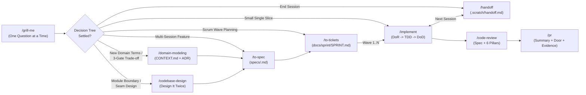

<div align="center">


# Antigravity Engineering Agent (V6)

**Plug-and-play Principal Software Engineering & Technical Scrum constitution, progressive-disclosure rules, focused deep-module skills, native subagents, cross-platform Node lifecycle hooks, and scheduled sidecars for Google Antigravity.**

<p align="center">
  <a href="CHANGELOG.md"></a>
  <a href="https://antigravity.google/docs"></a>
  <a href="https://antigravity.google/docs/rules"></a>
  <a href="#v5--v6-evolution--consolidation-matrix"></a>
  <a href="LICENSE"></a>
</p>

</div>

---

## Core Design Principles (V6 Enterprise Architecture)

1. **High-Signal Principal Engineer Persona (Anti-Sycophancy)**: Direct, rigorous, and strictly non-sycophantic pair-programming. Eliminates false agreement in favor of objective technical evaluation: `[Premise Breakdown] -> [Production Failure Mode] -> [Superior Engineering Alternative]`. When an enterprise setting requires standard corporate tone, exporting `AAC_PERSONA=neutral` instructs the `SessionStart` hook to inject clinical Staff Engineer prose across all interactions.
2. **User-Defined Architecture (Interview First, Zero Static Dogma)**: Never imposes a static folder hierarchy, rigid layer dogma, or assumed manifest stack. Discovers existing repo structure dynamically and **interviews the user first** (`ask_question` / `/grill-me`) whenever architecture, stack, or module topology are open.
3. **The 6 Non-Negotiable Engineering Pillars**: Defined once in `AGENTS.md` §3—every design and diff is stress-tested to be **Future-Proof, Scalable, Maintainable, Secure, High-Performance, and Upgradeable**.
4. **Expert Technical Scrum & Multi-Session Continuity**:
   - `/to-tickets` generates a committed **Scrum Sprint Wave Board (`docs/sprint/SPRINT.md`)** and session-sized vertical tracer-bullet tickets (`docs/sprint/tickets/<NN>-<slug>.md`) with **Definition of Ready (DoR)**, **Execution Waves (DAG)**, and **Definition of Done (DoD)**.
   - `/implement` executes 1 unblocked ticket test-first, commits atomically when the user authorizes commits, updates the ticket's `Session Handover & Completion Log`, and promotes newly unblocked tickets in `docs/sprint/SPRINT.md`.
   - `/handoff` checkpoints sprint progress, downstream seam notes, and the exact next command into `.scratch/handoff.md`.
5. **Cross-Platform Tested Hooks & Contained Subagents**:
   - `.agents/hooks.json` uses cross-platform `node -e` JSON parsers (`SessionStart` cold-start sprint/handoff detector, `PreToolUse` git destructive guard & production no-mock guard with `decision: "ask"` and fail-closed handling of malformed payloads).
   - `.agents/agents/*.md` subagents run with `commandExecutionPolicy: sandbox` with full operational capabilities (view, write, search, run).
6. **Non-Destructive SHA-256 Manifest Installer**:
   - Tracks managed files in `.agents/.aac-manifest.json`.
   - `upgrade` preserves `CONTEXT.md` and never overwrites user-modified `AGENTS.md`, rules, skills, or agents unless `--force` is passed (backs up to `.scratch/backups/<timestamp>/` and writes incoming updates to `<file>.aac-new`).

---

## V5 → V6 Evolution & Consolidation Matrix

AAC V6 consolidates 64 legacy fragmented skills into a cohesive, deep-module architecture, eliminating cognitive noise, redundant variants, and token bloat while upgrading core engineering workflows:

| Legacy V5 Area (64 Skills Bloat) | V6 Consolidated Architecture | Primary Seams & Purpose |
| :--- | :--- | :--- |
| **Caveman Suite** (14 fragmented skills: `caveman-discover`, `caveman-learn`, `caveman-manage`, etc.) | **Progressive Rule (`caveman.md`)** | High-signal, high-velocity communication & token-efficient engineering protocol without prompt bloat. |
| **Ponytail Suite** (6 fragmented skills: `ponytail-debt`, `ponytail-gain`, `ponytail-audit`, etc.) | **Progressive Rule (`ponytail.md`)** | 7-Rung Minimalist Ladder, root-cause caller mapping, and surgical in-place edits. |
| **Grilling Variants** (3 skills: `grill-me`, `grilling`, `grill-with-docs`) | **Unified `/grill-me` Skill** | Interactive one-question-at-a-time interview with `(Recommended)` first slot to define architecture & stress-test designs. |
| **Scattered Implementation** (`implement`, `implement-spec`, `lean-build`, `prototype`) | **Technical Scrum Wave Engine (`/to-tickets`, `/implement`, `/handoff`)** | Vertical tracer-bullet tickets with Execution Waves DAG (`docs/sprint/SPRINT.md`), DoR, DoD, and cross-session handover. |
| **Review & Verification Scripts** (`code-analyzer`, `quality-guard`, `security-scanner`) | **3 Native Subagents & Automated Suite** | Sandboxed `adversarial-reviewer`, `codebase-investigator`, `verification-runner`, plus `tests/aac.test.mjs`. |
| **Fragile Bash/PS1 Overwriters** | **SHA-256 Manifest CLI (`bin/cli.mjs`)** | Non-destructive tracking in `.agents/.aac-manifest.json`, conflict backup (`.scratch/backups/`), `.aac-new`, `--dry-run`, `uninstall`, and manifest path validation (no traversal, managed paths only). |

---

## End-to-End Engineering & Scrum Workflow


```mermaid
flowchart LR
    G["/grill-me\n(One Question at a Time)"] --> F{"Decision Tree\nSettled?"}
    F -->|"New Domain Terms /\n3-Gate Trade-off"| DM["/domain-modeling\n(CONTEXT.md + ADR)"]
    F -->|"Module Boundary /\nSeam Design"| CD["/codebase-design\n(Design It Twice)"]
    F -->|"Multi-Session Feature"| Spec["/to-spec\n(specs/<slug>.md)"]
    F -->|"Scrum Wave Planning"| Tickets["/to-tickets\n(docs/sprint/SPRINT.md)"]
    F -->|"Small Single Slice"| Impl["/implement\n(DoR -> TDD -> DoD)"]
    F -->|"End Session"| Handoff["/handoff\n(.scratch/handoff.md)"]
    DM --> Spec
    CD --> Spec
    Spec --> Tickets
    Tickets -->|"Wave 1..N"| Impl
    Impl <-->|"Next Session"| Handoff
    Impl --> Review["/code-review\n(Spec + 6 Pillars)"]
    Review --> PR["/pr\n(Summary + Door + Evidence)"]
```

---

## Repository Structure

```text
antigravity-agent/
├── .gitattributes                             # Deterministic LF/CRLF normalization for hooks, rules & tests
├── .gitignore                                 # Excludes secrets, scratch state, and MCP credentials
├── AGENTS.md                                  # Always-on Savage Gen-Z Principal Engineer & 6-Pillar Rules
├── CONTEXT.md                                 # User-Defined Architecture, Stack & Domain Glossary
├── package.json                               # NPX & GitHub Packages distributor (@rafaelghif/aac-core v6.0.0)
├── bin/cli.mjs                                # Non-destructive SHA-256 manifest CLI (init / upgrade / uninstall)
├── install.sh                                 # Linux / macOS installer (delegates all writes to bin/cli.mjs)
├── install.ps1                                # Windows PowerShell installer (delegates all writes to bin/cli.mjs)
├── tests/aac.test.mjs                         # Automated test suite (CLI, hooks bypass corpus, official frontmatter contract, link integrity)
├── LICENSE                                    # MIT License
├── SECURITY.md                                # Threat model & vulnerability disclosure policy
├── CHANGELOG.md                               # Release history
├── .github/workflows/publish-package.yml      # Matrix CI verification + provenance publishing
├── assets/
│   └── banner.png                             # Official repository banner
├── docs/
│   ├── adr/                                   # Architecture Decision Records (0001–0004)
│   └── agents/                                # Antigravity platform reference, skill routing, tracker config
└── .agents/
    ├── hooks.json                             # Cross-platform inline Node lifecycle hooks (SessionStart, PreToolUse)
    ├── mcp_config.example.json                # Secure MCP template (env-based secrets, explicit timeouts)
    ├── sidecars/repo-health/sidecar.json      # Antigravity App scheduled sidecar template
    ├── rules/                                 # 9 Modular Rules (flat directory, official trigger contract)
    │   ├── coding-standards.md                # DRY, KISS, YAGNI, SOLID/SRP, Clean Code (model_decision)
    │   ├── architecture-and-flow.md           # User-Defined Architecture, Deep Modules, E2E Flow (model_decision)
    │   ├── ponytail.md                        # 7-Rung Minimalist Ladder, Root Cause & Surgical Edits (model_decision)
    │   ├── caveman.md                         # Savage Gen-Z high-signal style & persona switch (model_decision)
    │   ├── database-migrations.md             # Expand-contract, CONCURRENTLY outside tx, SQL safety (model_decision)
    │   ├── security-and-auth.md               # BOLA/IDOR, idempotency, atomic locks, full SSRF defense (model_decision)
    │   ├── git-and-context.md                 # Conventional atomic commits, CONTEXT.md, Sprint Board (model_decision)
    │   ├── testing.md                         # Public-seam assertions, hermeticity, boundary coverage (glob)
    │   └── release-audit.md                   # Pre-release production readiness rubric (manual @mention)
    ├── skills/                                # 15 Focused Single-Responsibility Skills
    │   ├── browsing/                          # Live UI verification, E2E journeys & /browser workflow
    │   │   ├── SKILL.md
    │   │   ├── scripts/run-browser.mjs
    │   │   ├── examples/e2e-journey-example.mjs
    │   │   ├── references/locators-and-patterns.md
    │   │   └── references/antigravity-subagent.md
    │   ├── office/                            # Native multimodal Office parsing & automated document authoring
    │   │   ├── SKILL.md
    │   │   ├── scripts/extract-office.py
    │   │   ├── examples/generate-report.py
    │   │   ├── references/office-formats-and-tools.md
    │   │   └── references/document-conversions.md
    │   ├── grill-me/SKILL.md                  # One-question-at-a-time interview & 6-Pillar stress-test
    │   ├── domain-modeling/                   # Sharpens CONTEXT.md glossary & records 3-Gate ADRs
    │   │   ├── SKILL.md
    │   │   └── resources/adr-template.md
    │   ├── codebase-design/SKILL.md           # Deep modules & public test seams (Design It Twice)
    │   ├── to-spec/                           # Turns settled decisions into a technical specification
    │   │   ├── SKILL.md
    │   │   └── resources/spec-template.md
    │   ├── to-tickets/                        # Scrum Sprint Wave Board (SPRINT.md) & vertical tickets
    │   │   ├── SKILL.md
    │   │   ├── resources/sprint-board-template.md
    │   │   └── resources/ticket-template.md
    │   ├── implement/SKILL.md                 # Builds 1 Sprint ticket end-to-end (DoR -> TDD -> DoD -> Sync)
    │   ├── tdd/SKILL.md                       # Red -> Green -> Refactor test-driven development loop
    │   ├── diagnosing-bugs/SKILL.md           # Tight reproduction loop & scoped hypothesis falsification
    │   ├── safe-refactor/SKILL.md             # Behavior-preserving atomic code refactoring
    │   ├── database-migration/SKILL.md        # Zero-downtime Expand -> Migrate -> Contract migrations
    │   ├── code-review/SKILL.md               # Two-axis diff review (Spec fidelity + Engineering standards)
    │   ├── pr/                                # Writes PR description (Visual Summary, Door Type, Evidence)
    │   │   ├── SKILL.md
    │   │   └── resources/pr-template.md
    │   └── handoff/                           # Multi-session Scrum handover (.scratch/handoff.md + SPRINT.md)
    │       ├── SKILL.md
    │       └── resources/handoff-template.md
    └── agents/                                # 3 Native Custom Subagents (commandExecutionPolicy: sandbox)
        ├── codebase-investigator.md           # Fast operational recon & blast-radius tracer (model: flash, policy: sandbox)
        ├── adversarial-reviewer.md            # Independent Red-Team diff & 6-Pillar critic (policy: sandbox)
        └── verification-runner.md             # Isolated build, lint, typecheck & test runner (policy: sandbox)
```

---

## Verification & Platform Contract

Every claim in this repository is enforced by the shipped test suite, not by documentation alone:

```bash
npm test          # CLI idempotency, hook bypass corpus, official frontmatter/skill/subagent contract, relative-link integrity
npm run pack:check  # npm packaging contents
```

CI runs both commands on `ubuntu-latest`, `macos-latest`, and `windows-latest`. `.gitattributes` pins LF for every text file (CRLF for `.ps1`) so frontmatter parsing and hook commands behave identically across platforms.

Verified against the official Antigravity documentation (2026-11-01):

| Artifact | Official contract |
| :--- | :--- |
| `.agents/rules/*.md` | Flat directory, YAML `trigger` required (`always_on`, `model_decision`, `glob`, `manual`), `globs` for `glob`, `description` for `model_decision`; 24 KB per file, 20,000-token aggregate budget |
| `.agents/skills/<name>/SKILL.md` | One level deep, `name` + `description` frontmatter, progressive disclosure, decision tree for complex skills |
| `.agents/agents/<name>.md` | `name`, `description`, `tools`, `subagent`, `mainAgent`, `model` (`inherit`/`flash`/`pro`), `commandExecutionPolicy` (`off`/`sandbox`), `skills` |
| `.agents/hooks.json` | Named hooks with `SessionStart` / `PreToolUse` / `PostToolUse` / `PreInvocation` / `PostInvocation` / `Stop`; JSON on stdin/stdout; `decision` gating |
| `.agents/sidecars/<id>/sidecar.json` + `~/.gemini/config/config.json` | `command` or `builtin`, `args`, `restart_policy`, enabled per sidecar with optional `projectId` |
| `.agents/mcp_config.json` | `mcpServers` map; `command`/`args`/`env` for stdio or `url`/`serverUrl` for remote; `timeoutSeconds` supported |

The MCP template deliberately keeps credentials in `env` or `.agents/mcp.env`, never in `args`: command-line arguments are visible in process listings. GitHub integrations run via Node stdio (`@modelcontextprotocol/server-github`) without requiring Docker Desktop, or can be installed directly from the Antigravity MCP Store.

---

## Quick Start (Multi-Platform Installation, Upgrade & Uninstall)

**Prerequisite**: Node.js **>= 22** on `PATH`. The CLI and every lifecycle hook are Node programs, so there is no supported install path without it.

Install or upgrade into **any project** without touching the target project's `package.json`:

### Option 1: Universal NPX (npm Registry, GitHub Packages, or Direct GitHub)
```bash
# Install via npm Registry:
npx @rafaelghif/aac-core init

# Or via GitHub Packages (after configuring @rafaelghif:registry=https://npm.pkg.github.com):
npx @rafaelghif/aac-core init

# Or directly from GitHub:
npx github:rafaelghif/antigravity-agents-core init

# Preview planned changes without writing files:
npx @rafaelghif/aac-core upgrade --dry-run

# Non-destructive upgrade (preserves CONTEXT.md, custom hooks, and user-modified files; writes conflicts to *.aac-new):
npx @rafaelghif/aac-core upgrade

# Force overwrite modified managed files (backs up previous files to .scratch/backups/<timestamp>/):
npx @rafaelghif/aac-core upgrade --force

# Uninstall unmodified managed files (preserves CONTEXT.md and user modifications):
npx @rafaelghif/aac-core uninstall
```

### Option 2: Linux / macOS Shell (`install.sh`)
The script resolves `bin/cli.mjs` and delegates every write to it; it never copies managed files itself.
```bash
# Recommended: download the pinned tag, inspect it, then run it.
curl -fsSL -o install.sh https://raw.githubusercontent.com/rafaelghif/antigravity-agents-core/v6.0.0/install.sh
less install.sh
bash install.sh

# Non-destructive upgrade:
bash install.sh --upgrade

# Target another project / preview / pin a different ref:
bash install.sh /path/to/your-project [--upgrade] [--force] [--dry-run]
AAC_REF=main bash install.sh --upgrade

# Optional one-liner (same pinned tag, no mutable branch):
curl -fsSL https://raw.githubusercontent.com/rafaelghif/antigravity-agents-core/v6.0.0/install.sh | bash -s -- --upgrade
```

### Option 3: Windows PowerShell (`install.ps1`)
```powershell
# Recommended: download the pinned tag, inspect it, then run it in its own process.
Invoke-WebRequest -Uri https://raw.githubusercontent.com/rafaelghif/antigravity-agents-core/v6.0.0/install.ps1 -OutFile install.ps1
notepad install.ps1
powershell -NoProfile -File .\install.ps1 -TargetDir "C:\path\to\your-project" [-Upgrade] [-Force] [-DryRun]

# Pin a different ref:
$env:AAC_REF="main"; powershell -NoProfile -File .\install.ps1 -Upgrade

# Optional one-liner (same pinned tag, no mutable branch):
irm https://raw.githubusercontent.com/rafaelghif/antigravity-agents-core/v6.0.0/install.ps1 | iex
```

### Optional: Antigravity App Scheduled Sidecar (`--with-sidecar`)
> **Note**: Sidecars are supported on **Antigravity App only**, require an explicit `--project-id <id>`, and consume AI credits when hourly scheduled conversations run.
```bash
npx @rafaelghif/aac-core init --with-sidecar --project-id "<your-antigravity-project-id>"
```
